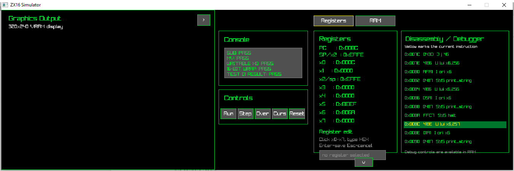
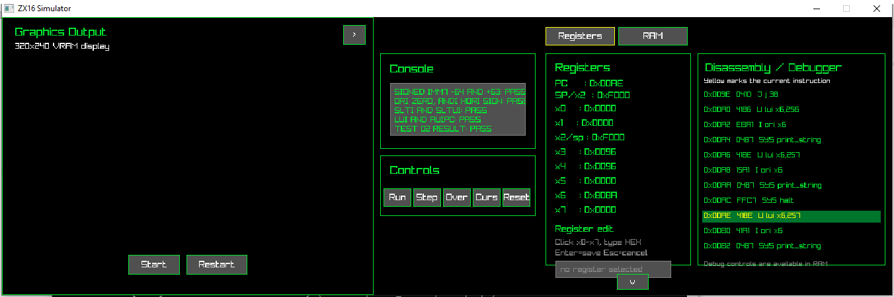
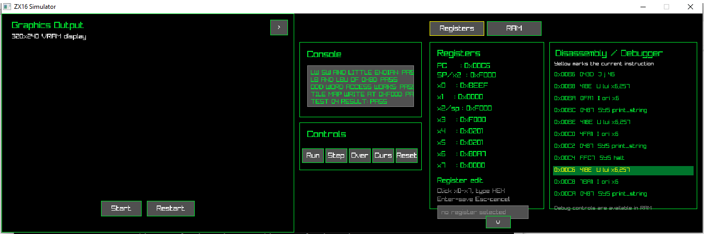
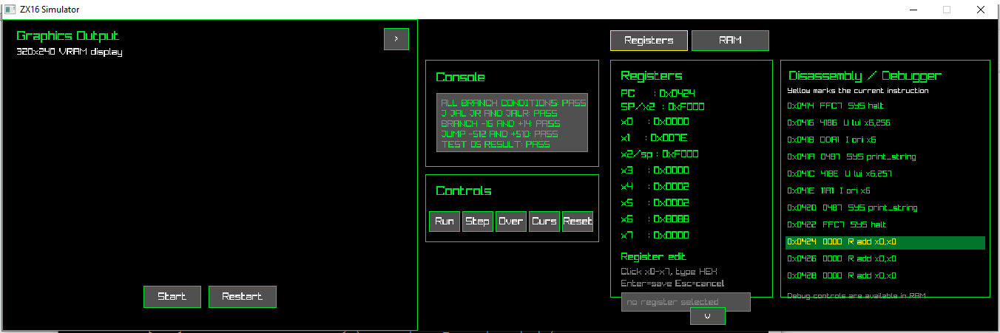
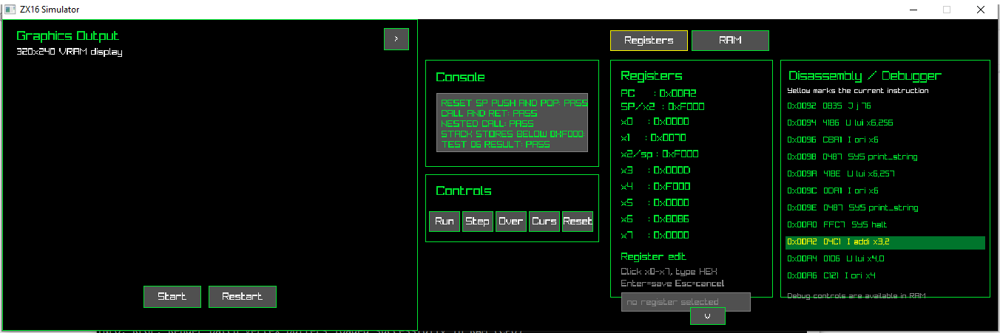
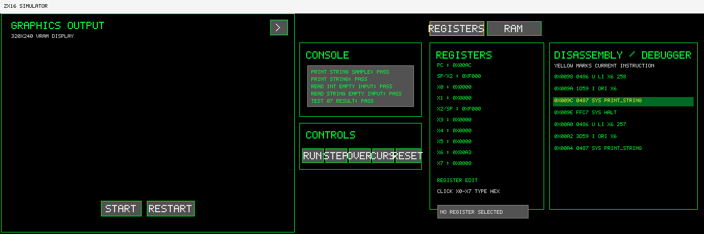

# ZX16 Assembly Tests

This file shows the result of the ten assembly tests.

## Running a test

```powershell
python assembler/zx16asm.py asm/tests/01_arithmetic_registers.s -o asm/bin/01_arithmetic_registers.bin -f bin
cmake-build-debug/zx16sim.exe asm/bin/01_arithmetic_registers.bin
```

Each program prints `PASS` when the result is correct. If a check fails, it prints
`FAIL` and stops.

## Test 01 - Arithmetic and registers

File: [`01_arithmetic_registers.s`](../asm/tests/01_arithmetic_registers.s)

Checks: `ADD`, `SUB`, `MV`, 16-bit overflow, and reading/writing `x0`.

Expected: all calculations are correct. `x0` keeps the value written to it and
`0xFFFF + 1` becomes `0x0000`.

Actual: PASS.



## Test 02 - Immediate instructions

File: [`02_immediate_operations.s`](../asm/tests/02_immediate_operations.s)

Checks: signed immediate limits `-64` and `+63`, logical immediate behavior,
`SLTI`, `SLTUI`, `LUI`, and `AUIPC`.

Expected: the signed limits work, `ORI` uses a zero-extended mask,
`ANDI/XORI` use the sign-extended immediate value, and `LUI 0x1AB` gives
`0xD580`.

Actual: PASS.



## Test 03 - Logic, shifts and comparisons

File: [`03_logic_shift_compare.s`](../asm/tests/03_logic_shift_compare.s)

Checks: `OR`, `AND`, `XOR`, register shifts, immediate shifts, `SLT`, and `SLTU`.

Expected: logical shift of `0x8000` by 15 gives `0x0001`, arithmetic shift gives
`0xFFFF`, signed `-1 < 1` is true, and unsigned `65535 < 1` is false.

Actual: PASS.


## Test 04 - Memory

File: [`04_memory_load_store.s`](../asm/tests/04_memory_load_store.s)

Checks: `LB`, `LBU`, `LW`, `SB`, `SW`, little-endian words, odd word access, and
a write to the tile map at `0xF000`.

Expected: `LB` of `0x80` gives `0xFF80`, `LBU` gives `0x0080`, odd-address
`SW/LW` still use little-endian order, and the tile-map write is stored.

Actual: PASS.



## Test 05 - Branches and jumps

File: [`05_branches_jumps.s`](../asm/tests/05_branches_jumps.s)

Checks: all branch conditions, `J`, `JAL`, `JR`, `JALR`, and PC-relative limits.

Expected: branches work at `-16` and `+14`, jumps work at `-512` and `+510`, and
`JAL/JALR` save `PC+2` as the return address.

Actual: PASS.



## Test 06 - Stack and functions

File: [`06_stack_subroutines.s`](../asm/tests/06_stack_subroutines.s)

Checks: reset SP, `PUSH`, `POP`, `CALL`, `RET`, and a nested call.

Expected: SP starts at `0xF000`, a push moves it to `0xEFFE`, a pop restores it,
and stack data is stored below `0xF000`.

Actual: PASS.



## Test 07 - Console and string services

File: [`07_console_string_services.s`](../asm/tests/07_console_string_services.s)

Checks: `print_int`, `print_char`, `print_string`, `read_int`, and
`read_string`.

Expected: `0x7FFF` prints as `32767`, `0x8000` prints as `-32768`, characters
and strings appear in order, and empty input reads report zero length/value.

Actual: PASS.



## Test 08 - RNG, keyboard and audio

File: [`08_rng_keyboard_audio.s`](../asm/tests/08_rng_keyboard_audio.s)

Checks: RNG seed/random services, keyboard read, tone, volume, and stop-audio
services.

Expected: seed `0xACE1` produces `0xD30F`, `0xF1A5`, then `0x1734`; seed zero
stays zero; unattended keyboard input returns no key; valid audio service calls
complete.

Actual: PASS.


## Test 09 - Graphics VRAM

File: [`09_graphics_vram.s`](../asm/tests/09_graphics_vram.s)

Checks: tile-map addresses, tile-definition addresses, low/high nibble pixel
order, palette bytes, and RGB332 expansion math.

Expected: tile-map writes work at `0xF000` and `0xF12B`, tile-definition writes
work at `0xF200` and `0xF9FF`, palette writes work at `0xFA00` and `0xFA0F`,
and full-intensity RGB332 channels expand to `0xFF`.

Actual: PASS.


## Test 10 - Full integration corner cases

File: [`10_full_integration_corner_cases.s`](../asm/tests/10_full_integration_corner_cases.s)

Checks: register wraparound and writable `x0`, odd-address memory access, sign
extension, loops, signed/unsigned comparisons, stack push/pop, nested calls,
RNG/keyboard/console services, and graphics VRAM edge addresses.

Expected: the combined program keeps `sp` balanced at `0xF000`, gets the seeded
RNG value `0x3830`, sees no unattended keyboard input, writes the final tile-map
cell, final tile-definition byte, and final palette byte, then prints PASS.

Actual: PASS.


## My simulator results

| Test | Result |
|---|---|
| 01 Arithmetic and registers | PASS |
| 02 Immediate instructions | PASS |
| 03 Logic, shifts and comparisons | PASS |
| 04 Memory | PASS |
| 05 Branches and jumps | PASS |
| 06 Stack and functions | PASS |
| 07 Console and string services | PASS |
| 08 RNG, keyboard and audio | PASS |
| 09 Graphics VRAM | PASS |
| 10 Full integration corner cases | PASS |

The supplied assembler built all ten programs. The programs use `print_string`
to show their results in the console.

## Reference simulator check

I also ran the original six `.bin` files with `reference/zx16sim.py`.

The reference simulator only prints with `print_int` and `print_char`. These
tests use `print_string`, so the reference console output is empty. I checked the
final message address in `x6` instead.

| Test | My simulator | Reference simulator | Note |
|---|---|---|---|
| 01 Arithmetic and registers | PASS | PASS | Same result |
| 02 Immediate instructions | PASS | PASS | Same result |
| 03 Logic, shifts and comparisons | PASS | PASS | Same result |
| 04 Memory | PASS | PASS | Same result |
| 05 Branches and jumps | PASS | PASS | Same result |
| 06 Stack and functions | PASS | PASS | Same result |

The provided reference simulator does not implement the newer console input,
RNG, keyboard, or audio ECALLs used by tests 07, 08, and 10, so those are
verified with the project simulator service behavior instead. Test 09 uses
ordinary loads, stores, shifts, and branches around graphics VRAM addresses.
